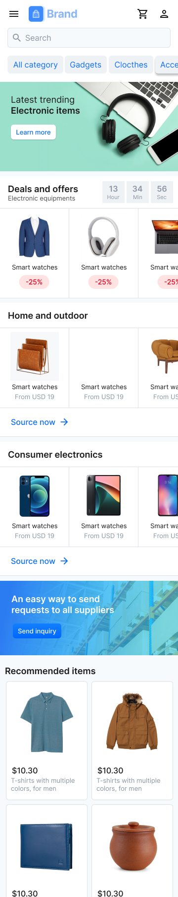

# E-Commerce Figma UI 📱

Este projeto consiste na criação de uma página principal de e-commerce utilizando apenas __HTML__ e __CSS__ puro, seguindo a abordagem __Mobile First__.

## Design 🎨

O design da página é baseado no [link do Figma](https://www.figma.com/community/file/1196354278225525048). Aqui está uma prévia da página:

<h3>Preview</h3>

<h3>My version</h3>

  

  
  *In Progress* 🚧

## Ícones 🎉

Para os ícones, este projeto utiliza a __CDN__ da biblioteca [Bootstrap Icons](https://icons.getbootstrap.com/), que fornece uma grande variedade de ícones para diversas finalidades.

## Como Contribuir 🤝

Se você deseja contribuir com este projeto, sinta-se à vontade para enviar pull requests ou abrir issues no [repositório GitHub](https://github.com/rafaelmaxdev/e-commerce-figma-ui).
